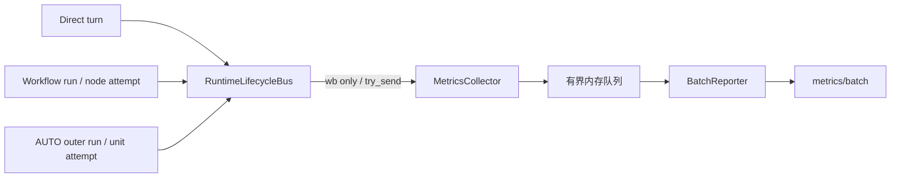

# WB 会话指标采集与批量上报设计

## 1. 目标与边界

本文重新定义 `POST /api/client-report/metrics/batch`。采集覆盖 Direct、Workflow、AUTO 三种会话模式的完整生命周期，并支持执行覆盖、交付终局、产物质量、效率成本、自动化、可靠性、模型质量七类价值追溯。

指标系统是 runtime 的观察者，不参与控制流程。指标构造、排队、批量发送和失败重试均不得阻塞或改变会话状态。能力只在 `wb` 渠道启用；其他渠道不创建采集订阅和上报 worker。

本次直接替换旧的“节点开始时补报前序节点 + 当前节点”协议，不保留双写、哨兵节点或旧消费路径。

## 2. 根因与设计选择

现有问题来自抽象层级不完整，而不是单个字段遗漏：旧模型只描述 Workflow node，无法自然表达 Direct turn、Workflow run、AUTO outer run、pause/resume、干预和 acceptance；终态还依赖下一节点触发补报。

因此统一为“执行单元 + 生命周期事件”：runtime 在事实发生并持久化后发布领域事件，采集订阅者只做转换并送入独立批量 worker。沿用项目已有 `RuntimeLifecycleBus`，不引入 OpenTelemetry、Kafka、复杂 schema registry 或 exactly-once 投递。



| 组件 | 职责 | 不负责 |
|---|---|---|
| runtime / ACP | 在状态确定后发布领域事实 | HTTP、重试、JSON 拼装 |
| `RuntimeLifecycleBus` | 异步分发、隔离 subscriber panic | 指标聚合 |
| `MetricsCollector` | 领域事件映射、身份与关联字段快照 | 修改 runtime 状态 |
| `BatchReporter` | 缓冲、批量、有限重试、诊断 | 无限重试、阻塞会话 |
| 服务端 | 按 `eventId` 幂等接收并聚合 | 推断未上报事实 |

## 3. 核心数据模型

### 3.1 执行单元

| `executionKind` | 模式 | 含义 | 稳定 `executionId` |
|---|---|---|---|
| `turn` | Direct | 一次用户消息到回复终态 | `taskId`（同一 task 不变）；attemptId 等于 taskId，attemptIndex 固定为 1 |
| `run` | Workflow | 一次 Workflow 运行 | `taskId` |
| `node-attempt` | Workflow | 某节点的一次实际尝试 | `taskId`（所有节点共享）；nodeId 为同一 run/round/node 稳定派生的逻辑节点 UUID，重试不变 |
| `outer-run` | AUTO | 一次 AUTO 总体交付 | `taskId` |
| `unit-attempt` | AUTO | worker、workflow invocation、merge、acceptance 的一次尝试 | `taskId`（所有 unit 共享）；nodeId 为 `DynamicNodeState.uuid`，重试不变 |

所有模式的 `executionId` 统一为 `taskId`，不再有 `parentExecutionId`。AUTO 模式下的 workflow wrapper 节点不上报指标。`workflow-invocation` 携带 `childRunId`，用于关联其内部 Workflow run。

`eventId`、`executionId`、`nodeId`、`attemptId` 必须为 UUID。所有模式的 `executionId` 统一为 `taskId`。Direct turn 的 attemptId 等于 taskId，attemptIndex 固定为 1。Workflow node 的 `nodeId` 由 run UUID 与 round/node 逻辑键用 UUID v5 稳定派生（重试不变），`attemptId` 使用 NodeState UUID（每次执行新建）。AUTO unit 的 `nodeId` 为 `DynamicNodeState.uuid`（重试不变），`attemptId` 由 nodeId 与本地 attempt 序号用 UUID v5 派生。`attemptIndex` 从本地 `attempt-NNN` 序号产生。started 事件不携带 model（ACP session 尚未启动，真实模型未知）；completed 事件从 `acp.session.json` 解析实际模型名。

### 3.2 生命周期事件

| `eventType` | 触发时机 | 关键载荷 |
|---|---|---|
| `execution.started` | 单元真实进入执行 | provider/model、unitKind、startedAt |
| `execution.completed` | 单元进入不可再运行终态 | outcome、terminalReason、usage、timing |
| `execution.paused` | runtime 进入 paused | pauseReason、当前 node/unit |
| `execution.resumed` | paused run 恢复 | previousPauseReason、当前 node/unit |
| `intervention.requested` | 需要输入、授权或人工决策 | interventionKind、当前 node/unit |
| `acceptance.completed` | AUTO acceptance 得到一次结果 | passed、acceptanceAttempt、firstPass |

Workflow/AUTO 的 `execution.paused`、`execution.resumed`、`intervention.requested` 必须携带当前执行节点或 unit 的 `nodeId/attemptId/attemptIndex/roundIndex/roleName`。进程中断恢复时不再重复当前节点的 `execution.started`，只发布 `execution.resumed`。

事件只能在领域状态完成持久化或 ACP turn 已确认终态后发布，避免上报“将要发生”的状态。不再用虚拟开始/结束节点表达 run 边界，也不在客户端预计算全自动交付率等报表结果。

## 4. 接口协议

```json
{
  "events": [{
    "eventId": "01J...",
    "eventRevision": 2,
    "eventType": "execution.completed",
    "occurredAt": "2026-07-31T13:20:15.120",
    "reportedAt": "2026-07-31T13:20:16.004",
    "userId": "raw-system-user",
    "workspace": "D:\\repo\\sasuke",
    "clientVersion": "0.1.0",
    "sessionMode": "workflow",
    "executionKind": "node-attempt",
    "executionId": "task-uuid",
    "taskTitle": "给项目添加 README",
    "nodeId": "node-uuid",
    "attemptId": "attempt-uuid",
    "attemptIndex": 1,
    "roundIndex": 1,
    "roleName": "代码审查员",
    "outcome": "success",
    "terminalReason": "completed",
    "provider": "codex-acp",
    "model": "gpt-5.6-sol",
    "usage": {"inputTokens": 1200, "outputTokens": 340, "cacheReadTokens": 800, "totalTokens": 1540},
    "modelUsages": [{
      "provider": "claude-acp",
      "model": "claude-sonnet-4-5",
      "inputTokens": 400,
      "outputTokens": 100,
      "cacheReadTokens": 200,
      "totalTokens": 500,
      "acpSessionElapsedMs": 20000
    }, {
      "provider": "codex-acp",
      "model": "gpt-5.6-sol",
      "inputTokens": 800,
      "outputTokens": 240,
      "cacheReadTokens": 600,
      "totalTokens": 1040,
      "acpSessionElapsedMs": 52120
    }],
    "timing": {"startedAt": "2026-07-31T13:19:01.000", "endedAt": "2026-07-31T13:20:15.120", "acpSessionElapsedMs": 72120}
  }]
}
```

请求头继续使用 `X-Maling-Report-Key`。服务端以 `eventId` 幂等接收，重复事件返回成功且不重复计数。客户端单批最多 100 条，以限制内存与请求体。

### 4.1 公共字段

| 字段 | 类型 | 说明 |
|---|---|---|
| `eventId` | string | 全局唯一事件 ID、服务端幂等键 |
| `eventRevision` | integer | 同一 execution 内从 1 开始严格递增的状态版本；用于异步乱序排序 |
| `eventType` | enum | 生命周期事实类型 |
| `occurredAt` | ISO-8601 | 事实真实发生时间，本地时间，精确到毫秒，不带时区偏移量 |
| `reportedAt` | ISO-8601 | 事件进入待上报队列的时间，本地时间，精确到毫秒，不带时区偏移量；生成后冻结，所有重试保持不变 |
| `userId` | string | 原始系统用户标识，不哈希、不替换为内部 UUID |
| `workspace` | string | 原始 workspace 路径/标识，不哈希、不只传目录名 |
| `clientVersion` | string | 客户端版本 |
| `sessionMode` | enum | `direct/workflow/auto` |
| `executionKind` | enum | 当前执行单元类型 |
| `executionId` | string | 等于 `taskId`（不再单独上报 taskId）；同一 task 所有事件保持一致 |
| `taskTitle` | string | 任务标题，即工作空间下展示的名称；所有事件携带同一值 |

这里的“本地时间”以客户端操作系统当前时区为准，不硬编码 UTC+8；跨平台协议测试必须按运行环境的本地时区计算预期值。传输格式继续按既有服务端契约省略时区偏移量。

`userId/workspace` 必须在事件产生时从执行上下文快照，不能在延迟发送时读取当前 workspace，否则切换项目会串数据。
共享生命周期总线中的 node/unit 事实必须携带事件所属 workspace 的 `repoRoot`。指标 producer 只能使用该事件路径创建作用域化 `SasukePaths`，读取 Usage、解析 child run、写 observability snapshot 和生成 `workspace` 字段；禁止使用 producer 注册时捕获的启动工作区路径。

### 4.2 关联字段

| 字段 | 适用范围 | 说明 |
|---|---|---|
| `nodeId` | Workflow node attempt、AUTO unit attempt、Workflow/AUTO run 中间态 | 节点稳定标识，重试不变。Workflow 由 run UUID + round/node 派生；AUTO 为 `DynamicNodeState.uuid` |
| `attemptId` | Direct turn、Workflow node attempt、AUTO unit attempt、Workflow/AUTO run 中间态 | 每次执行尝试唯一。Direct 的 attemptId 等于 executionId；Workflow 使用 NodeState UUID；AUTO 由 nodeId 与本地 attempt 序号派生 |
| `attemptIndex` | Direct turn、Workflow node attempt、AUTO unit attempt、Workflow/AUTO run 中间态 | 同一节点内的尝试序号，从 1 开始；Direct 固定为 1，Workflow/AUTO 真正重试时严格加一 |
| `roundIndex` | Workflow node attempt、AUTO unit attempt、Workflow/AUTO run 中间态 | 从 1 开始的 round 序号；用于首轮/后续轮次分析，不上报无统计价值的 round UUID |
| `roleName` | Workflow node attempt、AUTO unit attempt、Workflow/AUTO run 中间态 | 执行时节点/unit 的角色或标题快照；只用于展示和分组，不能作为唯一键 |
| `unitKind` | AUTO unit attempt | `worker/workflow-invocation/merge/acceptance` |
| `childRunId` | workflow invocation | 被调用 Workflow run UUID |

### 4.3 结果、质量与可靠性字段

| 字段 | 说明 |
|---|---|
| `outcome` | 最终结果是什么。Direct：`completed/failed/cancelled`；run：`success/failure/killed`；attempt：`success/failure/cancelled` |
| `terminalReason` | 为什么形成该结果。使用稳定分类枚举，不传对客文案 |
| `roundCount` | Workflow run 终态的总 round 数；`1` 表示首轮交付 |
| `passed` | acceptance 本次是否通过 |
| `acceptanceAttempt` | 同一 outer run 的第几次 acceptance，从 `1` 开始 |
| `firstPass` | `passed && acceptanceAttempt == 1` |
| `interventionKind` | `manual-decision/elicitation/permission/error-blocked` 等稳定枚举 |
| `pauseReason` | runtime 结构化暂停原因 |
| `failedAttemptId` | run/outer 失败时，指向决定终局的 node/unit attempt |

terminal counters 是自动化与恢复指标的唯一权威来源。中间 lifecycle event 用于时间线与当前状态，不进行服务端增量计数；服务端可用事实事件校验 counters，但不能覆盖 terminal 快照。

### 4.4 模型、用量与时间

| 字段 | 说明 |
|---|---|
| `provider/model` | attempt 结束时实际使用的最后一个 resolved provider/model，不取当前设置默认值；run/outer-run 不携带 |
| `usage.input/output/cacheRead/totalTokens` | attempt 粒度的 provider 返回或项目统一口径；不支持的可选值为 `null`；run/outer-run 不携带 |
| `modelUsages[]` | 在同一 attempt 内按 provider/model 分组的实际用量明细；数组顺序为首次使用顺序；run/outer-run 不携带 |
| `timing.startedAt/endedAt` | 执行墙钟边界 |
| `timing.acpSessionElapsedMs` | 来自 ACP timing 的净处理时间，不含用户等待 |

用户在执行过程中切换模型时，不得把切换前的 usage 归到最终模型。Usage 必须读取 ACP attempt totals，而不是 latest prompt 快照；缺失字段保持 `null`。Direct turn 开始保存累计 baseline，终态上报 terminal-baseline；elapsed 使用同一 delta 规则。每次实际 ACP prompt 完成时，以当次 resolved `provider + model` 和 usage delta 形成 segment；同一执行内相同 provider/model 的 segment 合并。累计值重置或出现负 delta 时，该段未知字段写 `null`，禁止猜测为 0。

Usage 的唯一权威粒度是 attempt：Direct turn、Workflow node-attempt、AUTO unit-attempt 分别独立留存；Workflow run 与 AUTO outer-run 只承载交付终态、质量和 counters，不读取最后节点或聚合子 attempt Usage。顶层各 usage 字段等于同一 attempt 的 `modelUsages[]` 中该字段非 null 值之和；未知段不参与求和。顶层 `provider/model` 仅表示该 attempt 的最终模型。删除有歧义的 `billableTokens`；后续成本应基于原始 token 与带生效日期的 provider/model 价格计算。

AUTO `workflow-invocation` 不承接 child Workflow 的 token：child node attempts 是模型 usage 权威来源；invocation 只上报自身独立 ACP 调用开销，没有独立调用时 usage/modelUsages 为 null。

### 4.5 计数字段

`counters` 只出现在交付层的 `execution.completed` 终态事件中：Direct `turn`、Workflow `run`、AUTO `outer-run`。node attempt 和 unit attempt 不携带 counters，避免父子执行重复统计。六个字段全部必填、使用非负整数；没有发生时传 `0`。

```json
"counters": {
  "pauseCount": 1,
  "resumeCount": 1,
  "permissionRequestCount": 2,
  "elicitationCount": 0,
  "manualContinueCount": 1,
  "followUpCount": 0
}
```

| 字段 | 适用范围 | 精确定义 |
|---|---|---|
| `pauseCount` | turn/run/outer | 状态从非 paused 进入 paused 的次数；重复写 paused 不累加 |
| `resumeCount` | turn/run/outer | 状态从 paused 回到 running 的次数；必须与真实状态转换对应 |
| `permissionRequestCount` | turn/run/outer | 新的 permission request ID 首次进入 pending 的次数；同一请求更新不重复计数 |
| `elicitationCount` | turn/run/outer | 新的 elicitation request ID 首次进入 pending 的次数 |
| `manualContinueCount` | turn/run/outer | 除 permission/elicitation 外，用户通过 manual check、分支决策、补充内容或继续按钮恢复 runtime 的次数；一次动作只能归入一个 Count |

| `followUpCount` | turn（Direct） | 同一 Direct task 内首轮之后的用户新输入次数；每次用户继续输入时累加，首轮与 permission/elicitation/automatic 等 runtime-continue 不计入 |

除 followUpCount 外不增加其他 Count：attempt/retry 可由 attempt 事件追溯，执行/失败单元可由 unit 终态聚合，acceptance 次数已有 `acceptanceAttempt`，人工决策可由 `intervention.requested` 聚合，模型价值由 `modelUsages[]` 体现。`roundCount` 继续作为 Workflow run 的质量字段，不在 counters 中重复保存。

### 4.6 完整枚举定义

协议中所有 enum 必须使用下列完整集合；新增值必须同时修改客户端、服务端 DTO、本文和 contract 测试。

| 枚举字段 | 完整允许值 |
|---|---|
| `eventType` | `execution.started`、`execution.completed`、`execution.paused`、`execution.resumed`、`intervention.requested`、`acceptance.completed` |
| `sessionMode` | `direct`、`workflow`、`auto` |
| `executionKind` | `turn`、`run`、`node-attempt`、`outer-run`、`unit-attempt` |
| `unitKind` | `worker`、`workflow-invocation`、`merge`、`acceptance` |
| `outcome` | `completed`、`failed`、`cancelled`、`success`、`failure`、`killed`；具体执行单元可用范围遵循 4.3 |
| `terminalReason` | `completed`、`user-cancelled`、`process-killed`、`provider-error`、`runtime-error`、`validation-error`、`execution-failed`、`retry-exhausted`、`acceptance-rejected`、`unknown` |
| `interventionKind` | `manual-decision`、`elicitation`、`permission`、`runtime-abnormal`、`error-blocked`、`process-interrupted` |
| `pauseReason` / `previousPauseReason` | `waiting-for-user-input`、`permission-requested`、`runtime-abnormal`、`error-blocked`、`process-interrupted` |

`terminalReasonCode` 是可选结构化内部错误码，不是 enum，不包含对客文案。统计只使用稳定的 `terminalReason` 分类，新增内部错误不要求客户端和服务端同步扩 enum。

所有 `execution.completed` 必须同时携带 `outcome` 和 `terminalReason`；非 terminal 事件二者都不得携带。合法组合为：

| 执行范围 | outcome | 常见 terminalReason |
|---|---|---|
| Direct turn | `completed` | `completed` |
| Direct turn | `failed` | `provider-error/runtime-error/validation-error/retry-exhausted/unknown` |
| Direct turn | `cancelled` | `user-cancelled/process-killed` |
| Workflow/AUTO run | `success` | `completed` |
| Workflow/AUTO run | `failure` | `provider-error/runtime-error/validation-error/execution-failed/retry-exhausted/acceptance-rejected/unknown` |
| Workflow/AUTO run | `killed` | `user-cancelled/process-killed` |
| node/unit attempt | `success` | `completed` |
| node/unit attempt | `failure` | `provider-error/runtime-error/validation-error/execution-failed/retry-exhausted/acceptance-rejected/unknown` |
| node/unit attempt | `cancelled` | `user-cancelled/process-killed` |

`runId` 不上报：run 自身以 `executionId` 标识。AUTO 模式下所有 unit 共享 outer run 的 `executionId`。`roundId` 不上报，改用有统计价值的 `roundIndex`。`childRunId` 继续用于 AUTO workflow-invocation 关联 child Workflow。

`attemptId/attemptIndex` 对 `turn/node-attempt/unit-attempt` 必填，对 `run/outer-run` 不适用，并作为服务端 Usage 留存和重试顺序依据。Direct 的 executionId/attemptId 等于 task UUID 且 attemptIndex 固定为 1，同一 task 多次输入在同一 attempt 内累加 usage/counters；Workflow/AUTO 满足 `attemptId != executionId`，多个重试 attempt 共享逻辑 node/unit executionId，AUTO unit 的 executionId 等于 outer run 的 `runUuid`，attemptIndex 从 1 严格递增。ACP/provider 在同一 attempt 内部的重连、多次 prompt 或模型切换不创建新的指标 attempt；节点或 unit 真正重试才同时生成新的 attemptId 和 attemptIndex。

## 5. 价值维度覆盖

| 价值维度 | Direct | Workflow | AUTO |
|---|---|---|---|
| 执行覆盖 | turn start/terminal | run + node attempt | outer run + unit attempt |
| 交付终局 | completed/failed/cancelled | success/failure/killed | success/failure/killed |
| 产物质量 | 不适用 | `roundCount == 1` 首轮交付 | acceptance `firstPass`；workflow invocation 关联 child run |
| 效率成本 | turn token、ACP 时间 | node-attempt token、ACP 时间 | unit-attempt token、ACP 时间 |
| 自动化 | turn 干预次数/类型 | 无干预执行率、全自动交付率 | 无干预执行率、全自动交付率 |
| 可靠性 | failed/cancelled 原因 | pause/resume、终态原因、node 故障 | outer 终态原因、leaf/unit 故障 |
| 模型质量 | turn provider/model | node attempt provider/model | unitKind + provider/model |

## 6. 三种模式生命周期

### Direct

用户提交并真实进入 ACP prompt 时发布 turn started；回复完成、provider 失败或用户停止时发布且只发布一个 terminal。首轮虽然内部复用单 Worker workflow，指标语义仍是 Direct turn，不得再计为 Workflow run/node。

### Workflow

run 进入 running 后发布 started；node attempt 在 provider 调用开始和状态持久化完成后分别发布 started/completed，并快照 `roundIndex/roleName`。pause/resume 属于 run 生命周期，paused/resumed/intervention.requested 中间态必须携带当前节点的 `nodeId/attemptId/attemptIndex/roundIndex/roleName`；进程中断恢复时只发布 resumed，不重复当前节点 started。最终 success/failure/killed 从稳定 `RunState` 发布。run terminal 从已持久化 round 计算 `roundCount`。

### AUTO

用户启动 AUTO 后发布 outer run started。dynamic worker、workflow invocation、merge、acceptance 均作为 unit attempt 上报真实 `unitKind`。每次 acceptance 完成额外发布结果，修复后再次验收递增 `acceptanceAttempt`。outer run 发布唯一终态，并用 `failedAttemptId` 定位决定终局的 leaf/unit attempt。AUTO 中间态同样携带当前 unit 的 `nodeId/attemptId/attemptIndex/roundIndex/roleName`。

## 7. 非阻塞与失败策略

1. wb 启动时注册唯一订阅 `desktop.metrics`；其他渠道不注册。
2. subscriber 只做纯映射和 `try_send`，不等待锁、不扫文件、不执行 HTTP。
3. 队列容量 2048；满时按确认决策直接丢弃新指标并写诊断日志，terminal 也不例外。事实生产队列记录 queue/capacity/eventKind，HTTP 上报队列额外记录 eventId/executionId；worker 断开使用独立原因。snapshot 队列满或断开时记录 path/revision，不输出快照内容。observability 状态更新入口在同一短锁区间内完成内存更新、快照 clone 和非阻塞 `try_send`，不得在锁内或调用线程执行 JSON 序列化、建目录、文件读写或替换。
4. reporter 每 2 秒或累计 100 条发送一批；按已冻结 `reportedAt` 的年月拆批，跨月事件不得进入同一请求。
5. 连接超时 3 秒、总超时 10 秒；timeout/5xx 最多重试 2 次，4xx 不重试。
6. 正常退出最多等待 500 ms 尽力 flush，不阻塞强制退出。
7. 上报日志继续写入唯一的 `metrics.log`。每次 HTTP attempt 必须打印 requestId、attempt、时间、URL、完整 JSON 请求体；响应记录相同 requestId、时间、status 和响应体，异常记录完整错误。
8. 完整请求体日志按产品要求包含原始 `userId/workspace`；`X-Maling-Report-Key` 及其他认证头严禁写入日志。日志文件沿用现有追加写入和目录，不新建第二套 metrics 日志。
9. `metrics.log` 最大 20 MB。下一条完整日志写入后将超限时，先清空文件、写 `log-reset` 时间和原因，再完整写当前记录；单条日志本身超过 20 MB 时只记录 requestId、实际字节数和 `payload-too-large`。日志失败不影响发送。

本阶段使用有界内存队列，不增加磁盘 outbox。若后续以实际丢失率证明需要离线补报，再单独引入有上限、可清理的 outbox。

## 8. WB 门禁

采集门禁为：`channel == "wb" && endpoint 有效 && API key 有效`。default 渠道即使残留 metrics 设置也不采集、不排队、不发 HTTP。wb 凭证缺失时安静禁用并写结构化诊断。心跳可复用同一门禁，但不属于会话生命周期事件。

## 9. 可维护性约束

- 领域 enum 放 core crate；HTTP DTO 放 desktop metrics 模块，orchestrator 禁止拼 JSON。
- `eventType/executionKind/outcome/terminalReason/unitKind` 必须使用 enum，不散落 string。
- provider/model、分模型 usage、counters、timing 在执行结束处形成不可变快照；subscriber 不扫描 runtime 目录猜状态。
- 事件到 DTO 的映射必须是纯函数并有单元测试。
- 新增模式或单元时同步更新采集矩阵、字段表、contract 测试和服务端口径。

### 9.1 采集状态所有权

每个 execution 维护单调 `eventRevision`；六个 Count、permission/elicitation request ID 去重集合和分模型 usage accumulator 由生命周期状态所有者统一管理，metrics subscriber 不自行累加。

采集状态由内存中的 execution state 作为当前进程内的权威事实源，并通过有界后台队列尽力保存到 execution 独立的 `observability.snapshot.json`。writer 复用 `AtomicWriteFile` 的跨平台原子替换语义，Windows 上目标文件已存在时也必须可连续覆盖。队列满、writer 断开、序列化或写入失败只降低指标和重启恢复精度，不得改变 Direct、Workflow、AUTO 的业务状态或推进结果。outer-run 的 counters 与 acceptanceAttempts 仍由同一内存状态管理，不复制第二套 canonical state。

当前阶段明确以会话非阻塞优先：observability 热路径不从 snapshot 同步恢复，新进程或已释放的 execution 从零状态开始，`collectionStateRecovered` 省略。因此 `eventRevision`、counters、usage 与 request ID 去重只保证当前内存生命周期内连续；跨进程精确恢复属于后续优化，只有能保持热路径零文件 I/O、零等待时才可重新接入。

## 10. 验收标准

- 三种模式的正常、失败、取消/kill 均有完整 start/terminal 对。
- Workflow pause/resume/node failure，AUTO outer/leaf failure 和每次 acceptance 可追溯。
- Direct 首轮不重复计数；AUTO workflow invocation 与 child Workflow 不重复聚合成本。
- provider/model、分模型 token、ACP 时间来自真实执行快照；模型切换前后 usage 不串归属。
- eventRevision 在同一内存 execution 生命周期和异步分发期间保持单调；当前阶段不以牺牲会话非阻塞性保证跨进程连续。
- 六个 Count 均符合状态转换定义，只出现在交付层终态，父子执行不重复计数。
- `metrics.log` 包含每次请求的日志时间和完整请求体，且不包含 API Key。
- 每条事件包含产生时的原始 `userId/workspace`。
- default 渠道零采集、零排队、零上报。
- 慢响应、超时、5xx、队列满和 subscriber panic 不影响会话状态与流程。

服务端数据库、月分区、幂等投影与详细统计口径见 `metrics-server-processing.md`。

## 11. 客户端实现状态（2026-07-31）

桌面端已完成旧节点快照协议的破坏式删除，并落地 `events[]` DTO、有界非阻塞队列、批量/按月拆分、有限重试、wb 注册门禁和单文件受限日志。runtime 已发布 Direct、Workflow、AUTO outer/unit、resume、acceptance、分模型 Usage 和持久化 revision 的权威事实；subscriber 只负责校验、纯 DTO 映射和非阻塞入队，不扫描目录推断业务状态。

core 的不可变事实与 `ExecutionObservabilityState` 已实现；状态对象负责 revision、六项 counters、请求 ID 去重和分模型 usage，桌面 subscriber 仅执行纯 DTO 映射与 `try_send`。snapshot 缺失时从零状态开始且不传 `collectionStateRecovered`；已有 snapshot 损坏时从零状态继续并携带 `collectionStateRecovered=false`；后台写失败不回滚业务状态。

截至 2026-08-01，Direct、Workflow、AUTO 的真实发布点均已接入上述事实模型。首次 Direct 内部 Worker 不再产生 Workflow 指标；AUTO dynamic node 明确携带 unitKind，acceptance 维护 outer 级尝试序号；metrics subscriber 只接收 `MetricsFact`，旧通知/UI lifecycle event 不进入上报队列。客户端实现与本文第 10 节可在本仓库固化的验收项一致。

### 11.1 影响性评估后的加固（2026-08-01）

- 采集门禁下沉到 core `App`：default 或 wb 凭证无效时不创建事实生产者，不构造指标、不写 snapshot、不入队，满足“零采集”而不仅是“零 HTTP”。
- lifecycle 热路径只执行有界 `try_send`；事实派生由单个后台 worker 串行处理。snapshot 同样由单个有界 writer 串行原子写入，避免每事件创建线程及旧 revision 覆盖新 revision。
- Direct turn 在 started 时生成严格 UUID，并由 attempt 上下文关联 permission/elicitation 和 terminal；终态后释放 observability 与关联状态，避免长时间运行导致状态表无界增长。
- reporter 的每个请求（含退出 flush）严格不超过 100 条；关闭时总等待上限为 500 ms。subscriber 在 DTO 映射前执行领域事实校验，非法事实只记录诊断并丢弃。
- 设置采用 wb 启动门禁；当前 wb 发布配置在运行期锁定，因此无需为关闭操作保留动态退订兼容路径。

### 11.2 100% 客户端验收补齐（2026-08-01）

- `acp.prompt-usage.jsonl` 在每次 prompt started/completed 时固化 resolved provider/model 和独立 Usage；node/unit 终态按 segment 聚合，正确支持 A→B→A，旧 journal 缺少 segment 元数据时才使用累计 totals 兼容读取。
- `resumeCount` 对所有真实 paused→running 转换计数。恢复入口必须显式写入并持久化 `ResumeCause`：`manual-continue`、`permission-resolved`、`elicitation-resolved`、`automatic-recovery`；只有 `manual-continue` 增加 `manualContinueCount`，禁止再根据 `PauseReason` 推断。
- AUTO outer-run 失败优先关联动态图中最新实际失败的 unit UUID；acceptance、invalid、killed、runtime error 分别映射为 `acceptance-rejected`、`validation-error`、`process-killed`、`runtime-error`，并在存在时携带结构化 `terminalReasonCode`。


### 11.3 人工追问次数（2026-08-07）

- Direct 同一 task 的 executionId/attemptId 保持 task UUID；首轮之后的用户新输入在同一 attempt 快照累加 `followUpCount`，usage 与 manualContinueCount 等计数也继续按累计快照上报。active turn 结束后仍通过同 attempt snapshot/usage baseline 识别后续输入，不依赖内存态。
- `followUpCount` 只统计用户新提交的 Direct prompt；permission/elicitation/automatic recovery 等 runtime-continue 不计入。
- 服务端 delivery stat 同步增加 `follow_up_count` 列，客户端 DTO 同步输出 `followUpCount`。

### 11.4 Snapshot 非阻塞与 Windows 覆盖加固（2026-08-17）

- 删除 observability 同步持久化入口；状态 mutex 内只更新内存、clone snapshot 并向容量 2048 的单 writer 执行 `try_send`，调用线程不再序列化或访问文件系统。
- 首次状态更新不再在全局 mutex 内同步加载历史 snapshot；本阶段接受重启后的 revision/counters/usage 精度下降，确保 continue、permission、elicitation 和 lifecycle 推进不等待磁盘。
- snapshot writer 复用仓库统一的 `storage::write_json` / `AtomicWriteFile::commit()`，支持 Windows 对既有目标文件的原子覆盖；所有失败仅记录诊断。
