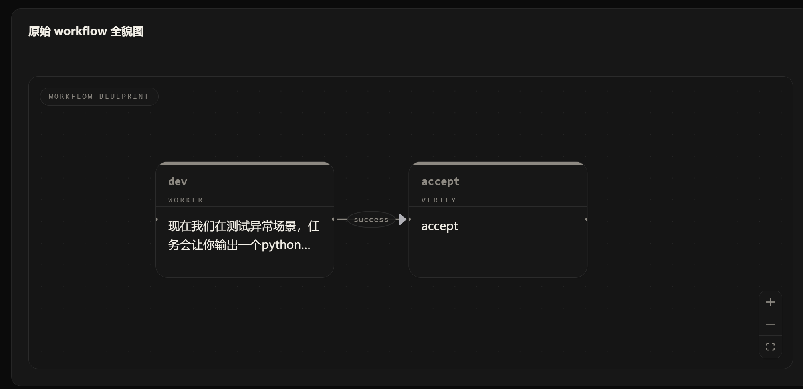
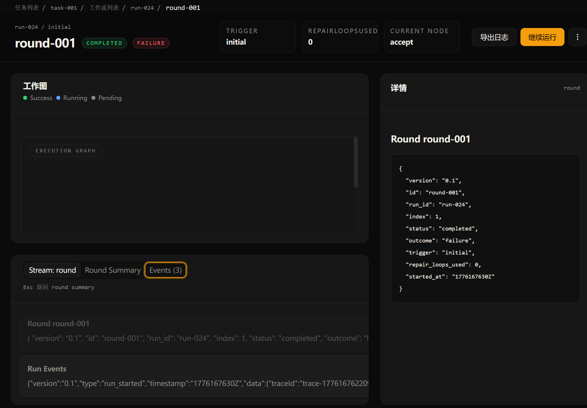
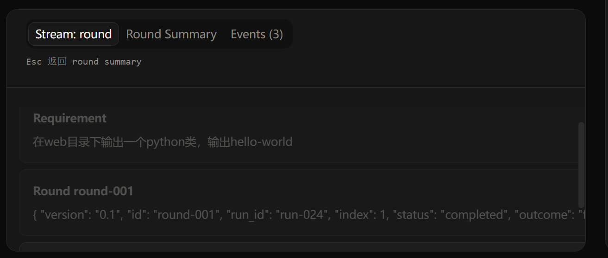
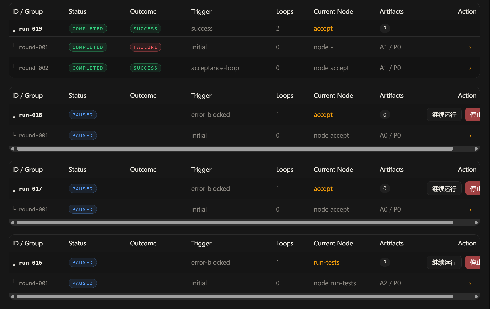
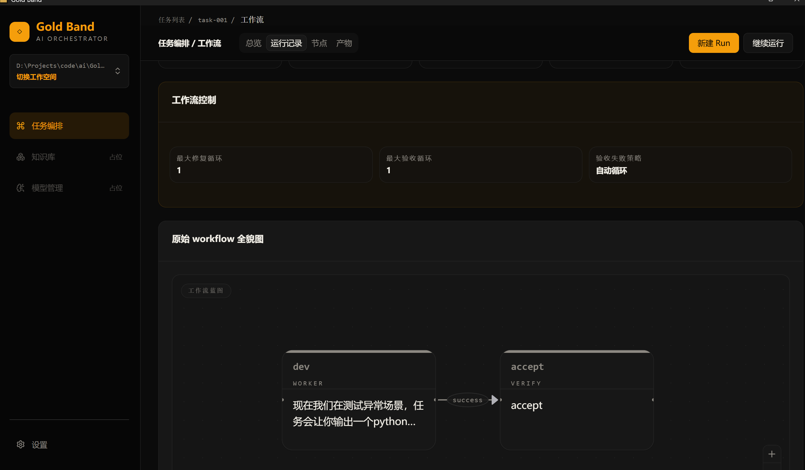
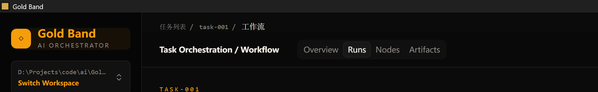
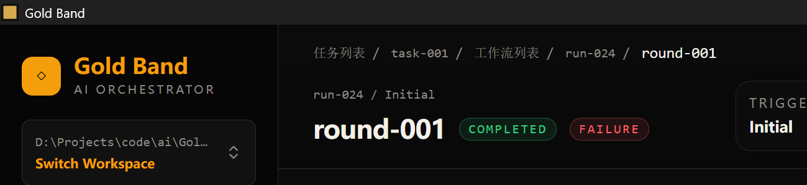
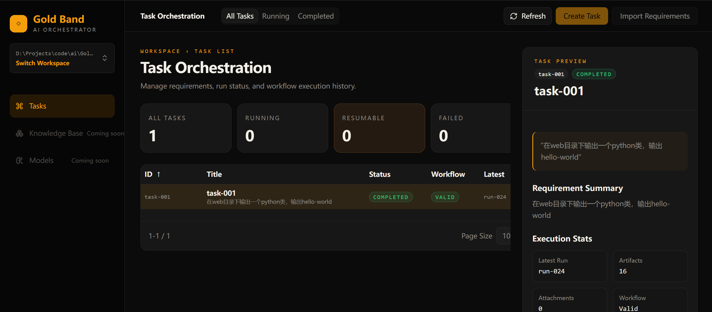
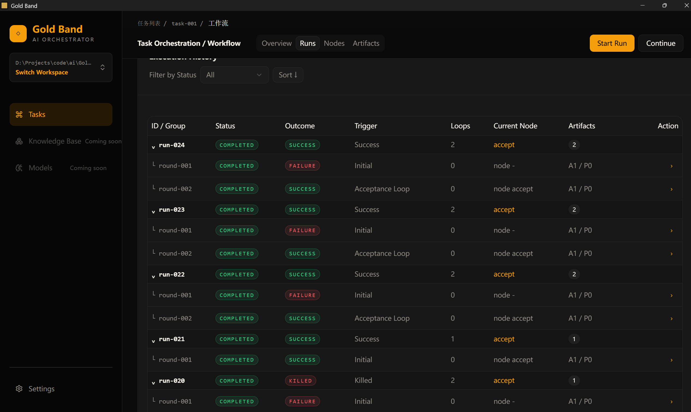
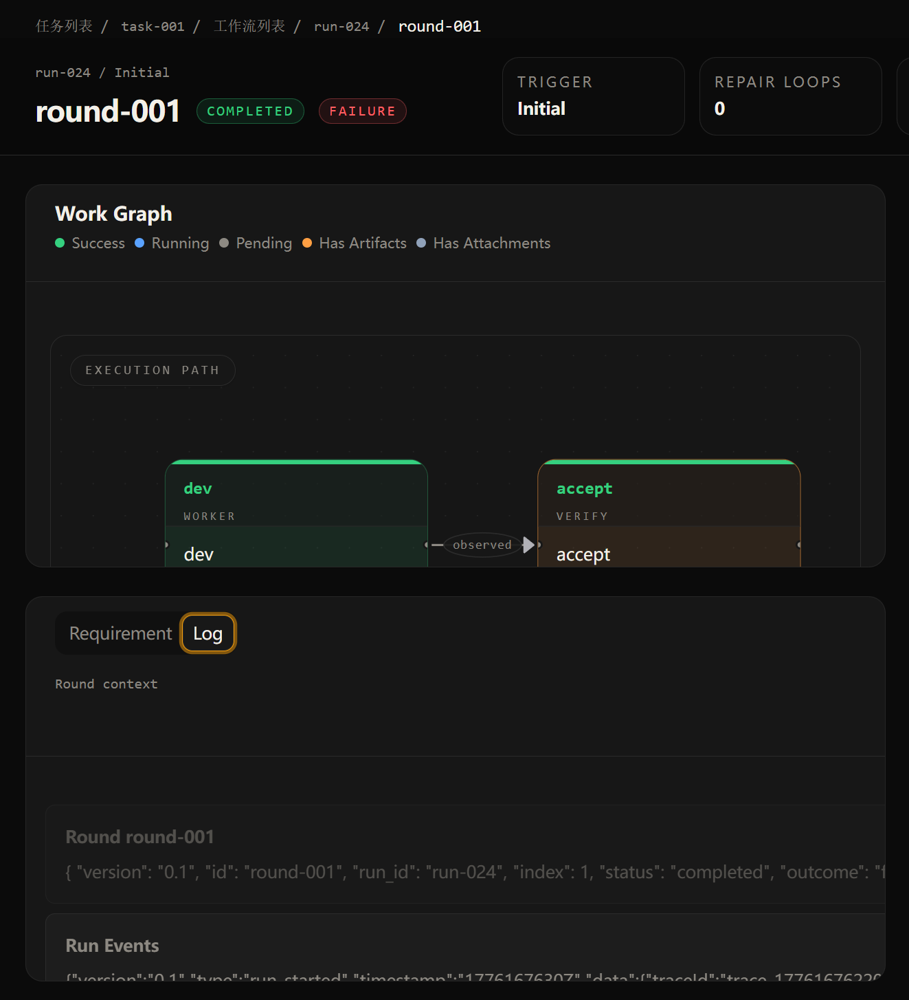

1.工作流界面需要加上一些工作流全局信息

比如.sasuke\tasks\task-001\authoring\workflow.json中的
"control": {
    "max_attempts": 3,
    "max_rounds": 2
  },

2.现在国际化做的还是有问题，语言选择中文，除了非英文不可的单词（比如AI\JAVA）等，其他应该都是中文，ID / Group	Status	Outcome	Trigger	Loops	Current Node	Artifacts，比如这些都应该是中文，如果选择了英文，那就全是英文

3.
现在round详情中的工作图无法显示，这里显示的样式应该和工作流界面的样式一致，并且这里我想展示的是该轮round真实走过的节点，而不是流程图全景，目前好像还没有一个东西记录这个信息，可能需要补充

4.
round详情这里有问题，1.三个tab无法切换 2.这里展示不是这样展示的，如果选中的的round，则展示包含当前task的requirement，当前的日志信息，如果选中了节点，则再加一个节点的artifact和attachments信息，对应的，工作流中需要给有artifacts和attachments的节点高亮显示。右部是详细信息查看页，点击日志、右键点击节点查看会话、点击artifact和attachments，则在此查看详细信息。这里我想说的是，requirement，当前的日志信息是并排的tab，如果点击了节点，就新增一个tab，而不是现在这种“round替换成node”的模式

5.
工作流列表这里1.没有做分页和排序 2.这里不应该有的有滑动条，有的没有，太丑了，应该按照最大的行宽来展示

-----
上述问题已经生成了一版，现在验收依然发现一些问题

1.工作流的全局信息可以放在工作流蓝图这个画板里吗？
2.，英文国际化中，为什么任务列表、工作流、工作流列表等标签还是中文的？
3.任务列表这里，做了分页后，可以看到宽度没有自适应了，有些内容被截断了
4.执行列表这里的操作按钮是不是没有了？
5.round详情这里可以明显看到执行图画板这里和下面的log这里的布局是有点问题的，默认只展示了一部分，有一部分被截断了